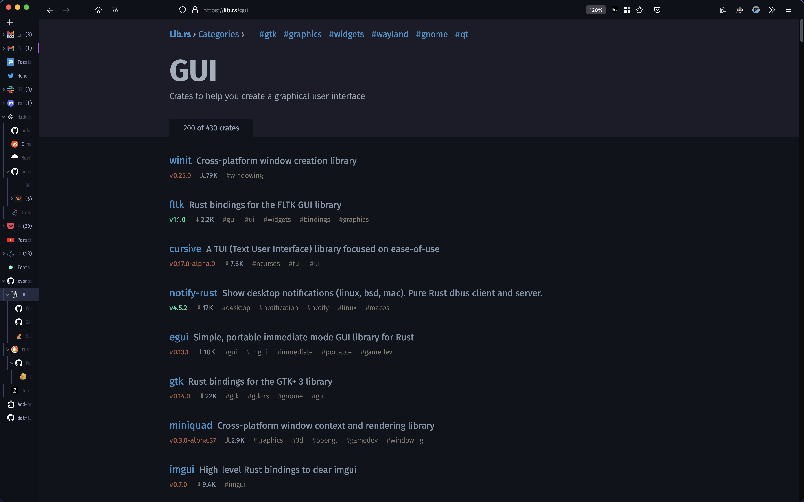
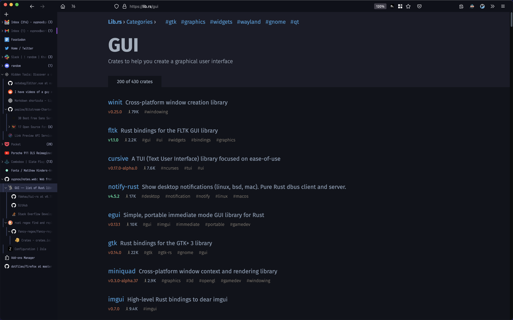

# Firefox

> This note has been copied from dendron. It will be updated occasionally.

Configs and Styles: [[sys.dotfiles]] & https://github.com/xypnox/dotfiles/tree/master/firefox

## Screenshots

- [Firefox](#firefox)
  - [Screenshots](#screenshots)
  - [Notes](#notes)
    - [Shortcuts](#shortcuts)
    - [Search bar filters: tabs, urls, bookmarks, history](#search-bar-filters-tabs-urls-bookmarks-history)
    - [How to set global zoom natively (without extensions)](#how-to-set-global-zoom-natively-without-extensions)
  - [Recommended extensions](#recommended-extensions)
    - [Generic](#generic)
    - [Notes](#notes-1)
    - [Dev](#dev)
    - [Customization](#customization)
    - [Youtube](#youtube)
  - [References and links](#references-and-links)

## Notes

### Shortcuts

`Ctrl+Shift+S` : Take Screenshots
`F6` - Unfocus the Location bar

### Search bar filters: tabs, urls, bookmarks, history

By typing in a particular character you may restrict the results with a filter, for instance

- `%` Open tabs
- `#` Page Titles
- `^` History
- `@` Urls
- `-` Bookmarks

### How to set global zoom natively (without extensions)

1. Enable [Browser Console command line](https://developer.mozilla.org/en-US/docs/Tools/Browser_Console#Browser_Console_command_line), by setting `devtools.chrome.enabled` to `true` in about:config or setting the "Enable chrome debugging" option in the developer tools settings (F12).
2. Open [Browser Console](https://developer.mozilla.org/en-US/docs/Tools/Browser_Console#Opening_the_Browser_Console) (Ctrl + Shift + J).
3. To set global zoom, where 1.33 is your desired zoom level, enter:
   `FullZoom.\_cps2.setGlobal(FullZoom.name,1.33,gBrowser.selectedBrowser.loadContext);`
4. To reset global zoom back to default, enter:
   `FullZoom.\_cps2.removeGlobal(FullZoom.name,gBrowser.selectedBrowser.loadContext);`

**Note:** for this to work, `browser.zoom.siteSpecific` must be set to `true` in about:config (the default is already `true`).

[Source](https://bugzilla.mozilla.org/show_bug.cgi?id=332275#c52).

[Source Meta.](https://www.reddit.com/r/firefox/comments/8kmryx/how_to_set_global_zoom_natively_without_extensions/)

## Recommended extensions

### Generic

- [Vimium](https://github.com/philc/vimium)
  [[sys.app.vim]] commands for the browser. Navigation and Interaction are supported nicely.
- [Tree Style Tabs](https://github.com/piroor/treestyletab)
  Use a tree to organize tabs. Collapse trees., manage according to projects, with infinite nesting. I usually reach 200+ tabs so getting an idea of how many tabs are open is tough, use the extension [Tab Count Icon](https://addons.mozilla.org/en-US/firefox/addon/tab-count-icon/).
- [Tab Session manager](https://github.com/sienori/Tab-Session-Manager)
  Backup your session (open tabs and the tree) every 15 minutes, so any crash won't suck away your tabs into oblivion.
- [UBlock Origin](https://addons.mozilla.org/en-US/firefox/addon/ublock-origin/)
  Necessary. (Essential)
- [Firefox Multi-Account Containers](https://addons.mozilla.org/en-GB/firefox/addon/multi-account-containers/)
  Useful for having different sessions without having multiple browsers or incognito. Create a container for one usecase and login on that. I use it for projects and work logins.

### Notes

- [Copy selection as markdown](https://addons.mozilla.org/en-US/firefox/addon/copy-selection-as-markdown/)
  Helpful for note taking in markdown, but can be used everywhere markdown is used.
- [Hypothes.is bookmarklet](https://addons.mozilla.org/en-US/firefox/addon/hypothes-is-bookmarklet/)
  Highlight and annotate any page on the web. Sync highlights, no restrictions, free API.

### Dev

- [React Developer Tools](https://addons.mozilla.org/en-US/firefox/addon/react-devtools/)
  Necessary because react is bad.
- [Dark reader](https://addons.mozilla.org/en-US/firefox/addon/darkreader/)
  For the dark. Smartly inverts the color scheme of the website to achieve dark mode. Passable darkmode without any efforts. (Does take some CPU usage.)

### Customization

- [Tabliss - New Tab](https://addons.mozilla.org/en-US/firefox/addon/tabliss/)
  Suckless newtab screen. I usually keep the background one color and add a centered clock and dev quote.
- [Stylus](https://github.com/openstyles/stylus)
  Style any site with custom css. Change colors and themes altogether.

### Youtube

- [Enhancer for YouTube](https://addons.mozilla.org/en-US/firefox/addon/enhancer-for-youtube/)
  Allows some neat enhancements such as 5x speeds ±0.1x, Expand mode where the video takes as much screen as possible.

## References and links

- https://www.reddit.com/r/firefox/
- https://www.reddit.com/r/FirefoxCSS/
- https://www.reddit.com/r/privacytoolsIO/
- https://www.reddit.com/r/startpages/

---

Quick and dirty way to make firefox dark: <https://overdodactyl.github.io/ShadowFox/>
